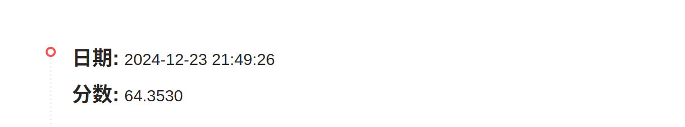

# Spark-lab4

## 文件说明
按`task1,2,3.py/ipynb`命名代码文件，输出数据在`res`文件夹下，按各个任务命名。

在结果文件夹中，`task3`是提交到天池中的数据，后续输出的数据在`task3_sqrt`中，但是直接可以看出不如原来或者与原来预测甚至一致，因此没再提交。

## Spark环境配置
实验中用`local`模式即可，无需配置集群。因此不涉及其他配置，下载好直接解压即可，压缩包中自带`Scala`环境。解压命令如下：
```
$ sudo tar -zxvf spark-3.5.3-bin-hadoop3.tgz -C/usr/local
```
重命名：
```
$ sudo mv spark-3.5.3-bin-hadoop3 spark
```

对`/etc/profile`和`~/.bashrc`文件进行配置，添加如下内容：
```
export SPARK_HOME=/usr/local/spark
export PATH=$SPARK_HOME/bin:$PATH
```

配置完成后，执行如下命令使配置生效：
```
$ source /etc/profile
$ source ~/.bashrc
```

执行`spark-shell`命令，若出现如下内容，则说明配置成功：

pyspark安装：
```
$ pip install pyspark
```

启动spark-shell: `pyspark`，如下：


运行示例文件，执行如下：


综上，spark环境local模式已完成，可以成功运行。

## 任务一
### 设计思路
**1. 初始化 SparkSession**
```
spark = SparkSession.builder.appName("task1").getOrCreate()
```
创建一个`SparkSession`对象，它是`PySpark`的入口点，用于读取数据、创建`DataFrame`等操作。设置应用程序的名称为 `task1`。

**2. 读取 CSV 文件**
```
data = spark.read.csv("file:///home/siwenyu/桌面/Spark-lab4/data/user_balance_table.csv", header=True, inferSchema=True).rd
```
使用 `spark.read.csv` 方法读取文件。`header=True`表示CSV文件的第一行是列名。`inferSchema=True`让Spark自动推断数据的类型。`.rdd` 将 DataFrame 转换为 RDD（弹性分布式数据集），以便进行更底层的操作。

**读取文件遇到的问题**

因为我没有配置`Hadoop`环境，而`Spark`采用惰性机制，只有遇到“行动”类型的操作，才会从头到尾执行所有操作。当我只写相对路径时，系统自动会从`hdfs`读取文件，但是我并没上传，因此不断报错读取失败。因此，要加载本地文件时候，必须采用`file:///`开头的这种格式。[（参考）](https://blog.csdn.net/abcdrachel/article/details/100122059)

**3. 选择列和过滤数据**
```
selected_col = ['user_id', 'report_date', 'total_purchase_amt', 'total_redeem_amt']
header = data.first()
data_task = data.filter(lambda x: x != header)
```
定义了需要处理的列。获取 RDD 的第一行，即列名。过滤掉列名行，以便后续处理实际数据。


**4. 子任务 1 (task_id == 1)**

目标：按日期汇总每天的总购买金额和总赎回金额。
```
map(lambda x: (x['report_date'], (x['total_purchase_amt'], x['total_redeem_amt'])))
```
 将数据映射为 (日期, (购买金额, 赎回金额)) 的形式。
```
reduceByKey(lambda x, y: (x[0] + y[0], x[1] + y[1]))
```
按日期聚合，计算每天的总购买金额和总赎回金额。将结果转换为 DataFrame 并显示，保存为 CSV 文件，使用 `coalesce(1)` 确保输出为一个文件。

**5. 子任务 2 (task_id == 2)**

目标：找出 2014 年 8 月记录日期数大于等于 5 的活跃用户。

```
filter(lambda x: x['report_date'] >= 20140801 and x['report_date'] <= 20140831)
```

过滤出 2014 年 8 月的数据。
```
map(lambda x: (x['user_id'], 1)) 
```
将数据映射为 (用户ID, 1) 的形式。
```
reduceByKey(lambda x, y: x + y)
```
按用户ID聚合，计算每个用户的记录日期数。
```
filter(lambda x: x[1] >= 5)
```
过滤出记录日期数大于等于 5 的用户。
```
map(lambda x: x[0])
```
提取活跃用户的用户ID。
```
num = data_task2.count()
```
计算活跃用户的数量并打印。
### 运行截图
两次任务截图如下，任务1详情输出见`res`文件夹中[task1_1](res/task1_1)：


## 任务二
### 设计思路
**1. 开始阶段与上面类似，但是需要读取`CSV`文件，创建临时视图，以便在 `SQL` 查询中使用。**

**2. 计算每个城市的平均余额（在 2014 年 3 月 1 日）**
* 使用 SQL 语句连接 `user_profile_table` 和 `user_balance_tabl`e，条件是 `up.user_id=ub.user_id`。
* 过滤出 `report_date` 为 '20140301' 的记录。
* 按城市分组，并计算每个城市的平均余额。
* 按平均余额降序排列。
* `res1.show()` 显示查询结果。

  
**3. 找出每个城市在2014年8月资金流动量排名前三的用户**
* 使用 SQL 语句连接 `user_profile_table` 和 `user_balance_table`，条件是 `up.user_id = ub.user_id`。
* 过滤出`report_date`为 `'201408%'` 的记录（即 2014 年 8 月）。
* 计算每个用户的总资金流动量（购买金额 + 赎回金额）。
* 使用窗口函数 `RANK()` 按城市分组，并按总资金流动量降序排列，计算排名。
* 外层查询选择排名在前三的用户。
* `res2.show()` 显示查询结果。

**事实上，这两个子任务思路基本从参照`实验三`，与任务2和4的SQL语句基本一致。**

**4. 输出结果文件**

**注意**，`write.mode("overwrite")` 指定写入模式为覆盖，如果目标路径已存在文件则会被覆盖。

### 运行截图
两个子任务输出结果如下，详情见`res`文件夹中[task2_1](res/task2_1)和[task2_2](res/task2_2)。


## 任务三
### 设计思路
**1. 数据读取与预处理**
首先会话建立，读取文件，定义一个基准日期 `base_date`，为 `"2013-07-01"`，并将其转换为日期类型。使用 withColumn 方法将 report_date 列中的字符串转换为日期类型，格式为 "yyyyMMdd"。计算每个日期与基准日期之间的天数差，并将结果存储在新的 `sequence` 列中。

从原始`df` 中选择`sequence` 和 `total_purchase_amt` 列，并按 `sequence` 列排序，创建一个新的 `DataFrame`，同样地，选择 `sequence` 和 `total_redeem_am`t 列，并排序，创建另一个。

检查 `total_purchase_amt` 和 `total_redeem_amt` 列中是否存在空值。（此处代码已注释，因为输出没有空值）

将金额总值列的数据类型转换为双精度浮点数（double）。

将 `sequence` 列转换为特征向量（`features`），并将 `val_col` 列重命名为 `label`。

**2. 模型训练与预测**

导入多种回归模型类，包括 `IsotonicRegression`、`GBTRegressor`、`RandomForestRegressor` 和 `GeneralizedLinearRegression`。使用不同的回归模型进行训练，前三个输出结果30天预测值完全一样，最终选择了 `GeneralizedLinearRegression` 模型。

```
# iso_reg=IsotonicRegression(featuresCol="features",labelCol="label")
# purchase_model=iso_reg.fit(purchase)
# redeem_model=iso_reg.fit(redeem)

# gbt=GBTRegressor(featuresCol="features",labelCol="label",maxIter=100,seed=1,stepSize=0.1,maxDepth=7)
# purchase_model=gbt.fit(purchase)
# redeem_model=gbt.fit(redeem)

# rf=RandomForestRegressor(featuresCol="features",labelCol="label",maxDepth=7,numTrees=100,seed=1)
# purchase_model=rf.fit(purchase)
# redeem_model=rf.fit(redeem)

glr=GeneralizedLinearRegression(featuresCol="features",labelCol="label",family="gaussian",maxIter=520,regParam=0.233,tol=1e-7,link="log",linkPower=3.3)
purchase_model=glr.fit(purchase)
redeem_model=glr.fit(redeem)
```

使用 `GeneralizedLinearRegression` 模型分别对 `purchase` 和 `redeem` 数据进行训练，部分参数说明如下：
* family="gaussian"：指定响应变量的分布族为高斯分布。
* maxIter=520：设置最大迭代步数为 520，以提高模型的拟合精度。
* regParam=0.233：设置 l2 正则系数为 0.233，用于防止过拟合。
* tol=1e-7：设置收敛精度为 1e-7，以确保模型训练的精度。
* link="log"：指定**连接函数为对数函数**，适用于高斯分布。
* linkPower=3.3：设置连接函数的超参为 3.3，但由于分布族为 "gaussian"，该参数不会生效。
  
获取最后一个日期的特征值，生成未来 30 天的日期序列，并将其转换为`DataFrame`，使用`VectorAssembler`将日期列转换为特征向量，并分别使用训练好的模型对 `future_days_df` 进行预测，得到`purchase_future`和`redeem_future`。
### 运行截图
输出结果如下：


最高成绩如下：


前期提交说明：

指定响应变量的分布族为高斯分布，但连接函数为**全等函数（下）**和使用分布族为**泊松分布（上）**的成绩如下：


